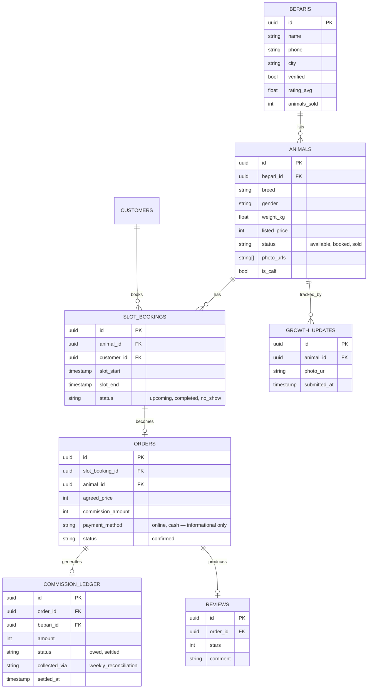

# mandi.pk — Technical Requirements Document
**Companion doc:** mandi-pk-PRD.md
**City:** Multan

---

## 1. Stack

| Layer | Choice | Why |
|---|---|---|
| Frontend | Vanilla HTML/CSS/JS | Matches your established stack; no build-step overhead under time pressure |
| Backend/data | Supabase (Postgres + Auth + Edge Functions) | Matches your existing choice for sites needing backend/admin functionality |
| Hosting | Vercel | Matches your pattern for backend-needing sites |
| Payments (demo) | Simulated — see §7 | Real JazzCash/Easypaisa/gateway integration is a post-competition step, not a 48h build item |

## 2. Architecture

```
Customer (browser)          Bepari (browser)
      │                            │
      ▼                            ▼
            Vercel
   (static frontend + API routes)
                  │
                  ▼
             Supabase
   ├── Auth              (two roles: customer, bepari)
   ├── Postgres + RLS     (all app data)
   └── Edge function      (slot-end alert trigger, commission calc)
```

## 3. Data model



## 4. Auth

- Supabase Auth, two roles: `customer` and `bepari`, stored as a `role` claim
- Separate dashboards route based on role after login
- RLS scoped by `auth.uid()` on every table from day one

## 5. Booking & order flow (implementation of PRD §5.5–5.7)

1. Customer books a slot → row in `slot_bookings` (status `upcoming`)
2. At `slot_end`, an Edge Function flips status to `completed` and fires the bepari alert (see §6)
3. Bepari dashboard → "Confirm order" → selects the animal tied to that booking, enters agreed price
4. Server computes and stores `commission_amount = round(agreed_price * 0.05)` against the order, purely for platform bookkeeping — nothing is charged to the customer at this step
5. Row inserted into `orders` (`payment_method` logged as informational only); animal status → `sold`
6. Customer pays the bepari the **full negotiated price directly** — online or cash, entirely outside the platform
7. Post-payment, bepari dashboard prompts for a review → row in `reviews`, feeds `beparis.rating_avg`
8. The order's `commission_amount` sits as `owed` in `commission_ledger` until the weekly reconciliation job collects it from the bepari (see §7)

Worked example (PKR 250,000 animal): the customer pays the bepari the full 250,000 directly. The platform separately owes-tracks a 12,500 commission against that order, collected from the bepari at the next weekly reconciliation — the customer never sees or pays this step.

## 6. Alert mechanic

- Edge Function (cron, runs every few minutes) finds `slot_bookings` where `slot_end < now()` and `status = 'upcoming'`
- Flips them to `completed`, and creates a pending prompt the bepari dashboard surfaces on next load: **"Was [animal] sold? Yes/No"**
- Yes → routes into the order-confirmation flow (§5.3)
- No → animal returns to `available`, slot freed for rebooking

## 7. Weekly commission reconciliation

This is now the platform's only commission-collection mechanism — there is no online payment step at order confirmation.

- Every confirmed order (regardless of `payment_method`) rolls into a weekly Edge Function job
- Job sums owed commission per bepari across the week's orders, marks each `commission_ledger` row `collected_via = 'weekly_reconciliation'`
- Bepari dashboard shows a running "commission owed" total, cleared when the bepari pays (bank transfer/JazzCash/Easypaisa) and an admin marks it settled
- **Trust risk to design around:** since nothing is collected automatically, an under-reporting bepari costs the platform commission. Mitigate by tying the verified badge/ranking directly to reconciliation accuracy — a bepari who's ever short on a weekly settlement loses badge standing, not just a polite reminder
- For the competition demo: a static "reconciliation preview" screen is enough — the logic is what's judged, not a real week having passed

## 8. Payments (demo scope)

No payment gateway is needed for this build — the platform never collects money at the point of sale. The customer-to-bepari payment happens entirely off-platform (online transfer or cash, their choice), and the platform's only "payment" surface is the bepari-facing weekly commission-owed screen from §7.

For the competition demo: seed a few dummy orders with different `commission_ledger` states (`owed`, `settled`) so the reconciliation screen has something real to show judges.

## 9. Security

- RLS on every table: customers see their own bookings/orders; beparis see only their own animals/orders
- Only the Supabase **anon key** ships client-side; the **service_role key** never touches the frontend — commission calculation and the alert cron run in Edge Functions
- HTTPS via Vercel by default
- Input sanitization on bepari-submitted text (animal descriptions, review comments) before render
- Photo uploads restricted by file type/size at the API layer
- Supabase keys as Vercel environment variables, never committed to the repo

## 10. Deployment

- GitHub repo → Vercel, auto-deploy on push to `main`
- Dedicated Supabase project for mandi.pk
- Public build link required for submission (per Imaginathon's Share step) — this is the deployed Vercel URL

## 11. Dummy data plan

- 6–10 dummy beparis (mix of verified/unverified) with placeholder catalogs
- 20–30 dummy animals across breeds/weights/prices, a few flagged `is_calf` to demo growth tracking
- A few pre-seeded slot bookings in different states (`upcoming`, `completed`) so the alert flow is demoable without waiting for real time to pass
